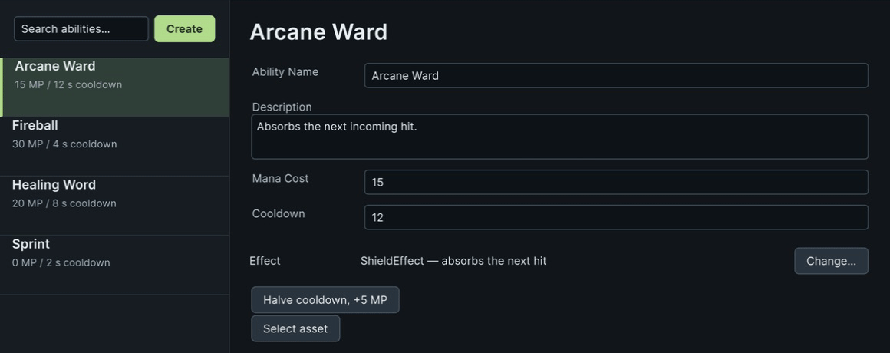

# EditorTools Sample

An editor window and a custom inspector for a small `AbilityConfig` asset type, built entirely in code with the package's editor helpers: the fluent `VisualElement` extensions, `SerializedProperty` setters, display-name helpers and the type-picker window as a public API. The references live in [VisualElement Extensions](../../../Documentation/07-visual-element-extensions.md), [SerializedProperty Extensions](../../../Documentation/08-serialized-property-extensions.md), [Editor Helpers](../../../Documentation/09-editor-helpers.md) and [TypeSelectorWindow](../../../Documentation/02-serializable-types.md#typeselectorwindow).

```csharp
rootVisualElement
    .SetFlexDirection(FlexDirection.Row)
    .AddChild(list.SetWidth(200))
    .AddChild(details.SetFlexGrow(1));
```

Select an ability to edit its properties and view its effect description.

## Open it

1. Import the sample. There is no scene.
2. Open **Tools → Aspid 🐍 → FastTools → Samples → Ability Catalog**. The left pane lists the four `AbilityConfig` assets from `Data/`; select one.



Halve cooldown, +5 MP updates both the fields and effect description; Undo restores them.

## Try

1. **A ListView in five calls.** `SetItemsSource`, `SetMakeItem`, `SetBindItem`, `SetFixedItemHeight`, `AddSelectionChanged`: the whole list is one chain. Type in the search field; `AddValueChanged` filters the source and `RefreshItems` redraws.
2. **Binding.** The detail pane's fields are plain `PropertyField`s under one container with `.BindTo(serializedObject)`. Edit the name: the list updates, the asset is dirty, Undo works, and the standard Inspector shows the same value.
3. **Typed property setters.** Press **Halve cooldown, +5 MP**. The handler chains `SetFloat` and `SetIntAndApply` on `SerializedProperty` instead of touching the asset directly, so the change is one Undo step and lands in the file.
4. **The type picker from code.** Press **Change…** next to `Effect`. `TypeSelectorWindow.Show` opens the same searchable window `[TypeSelector]` uses, anchored to the button and filtered to `IAbilityEffect` implementations; the result is written into a `string` property. Pick `HealEffect`. Change `Mana Cost` in the window or Inspector, then Undo/Redo: the effect description follows the data.
5. **Display names and script access.** The pane title is `config.GetScriptName()`, which honors `[AddComponentMenu]` when present. Double-click it: `AddOpenScriptCommand` opens `AbilityConfig.cs` in your IDE.
6. **The inspector.** Select `Data/Sprint.asset` in the Project window. `AbilityConfigEditor` draws a card with a status badge and a warning `HelpBox` that appears only while `Mana Cost` is `0`; `PropertyField.AddValueChanged` drives both. Set the cost to `10` and back.
7. **Create.** Press **Create** to add an asset next to the selected one; it appears in the list, selected.

## Where to look

| File | Shows |
|---|---|
| `Scripts/Editor/AbilityCatalogWindow.cs` | `ListView` extensions, `BindTo`, `SetFloat` / `SetIntAndApply`, `TypeSelectorWindow.Show` with a `TypeSelectorFilter`, `GetScriptName`, `AddOpenScriptCommand` |
| `Scripts/Editor/AbilityConfigEditor.cs` | A reactive custom inspector with the style and layout setters |
| `Scripts/AbilityConfig.cs` | The data; `[TypeSelector]` on the effect string so the plain Inspector gets the same picker |
| `Scripts/Effects/` | The candidate types the picker offers |
