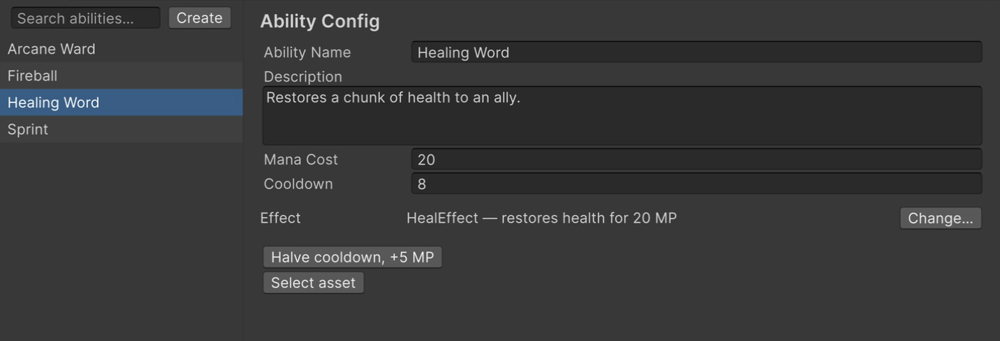

# Пример EditorTools

Окно редактора и кастомный инспектор для небольшого типа ассета `AbilityConfig`, собранные целиком в коде на editor-хелперах пакета: fluent-расширениях `VisualElement`, сеттерах `SerializedProperty`, хелперах отображаемых имён и окне выбора типа как публичном API. Справочники — [VisualElement Extensions](../../../Documentation/ru/07-visual-element-extensions.md), [SerializedProperty Extensions](../../../Documentation/ru/08-serialized-property-extensions.md), [Editor Helpers](../../../Documentation/ru/09-editor-helpers.md) и [TypeSelectorWindow](../../../Documentation/ru/02-serializable-types.md#typeselectorwindow).

```csharp
rootVisualElement
    .SetFlexDirection(FlexDirection.Row)
    .AddChild(list.SetWidth(200))
    .AddChild(details.SetFlexGrow(1));
```



Выберите способность, чтобы изменить её свойства и увидеть описание эффекта.

## Как открыть

1. Импортируйте пример. Сцены нет.
2. Откройте **Tools → Aspid 🐍 → FastTools → Samples → Ability Catalog**. Левая панель перечисляет четыре ассета `AbilityConfig` из `Data/`; выберите один.


Halve cooldown, +5 MP обновляет поля и описание эффекта; Undo возвращает прежние значения.

## Попробуйте

1. **ListView в пять вызовов.** `SetItemsSource`, `SetMakeItem`, `SetBindItem`, `SetFixedItemHeight`, `AddSelectionChanged`: весь список — одна цепочка. Наберите что-нибудь в поле поиска; `AddValueChanged` фильтрует источник, `RefreshItems` перерисовывает.
2. **Биндинг.** Поля правой панели — обычные `PropertyField` в одном контейнере с `.BindTo(serializedObject)`. Измените имя: список обновится, ассет станет dirty, Undo работает, а стандартный инспектор показывает то же значение.
3. **Типизированные сеттеры свойств.** Нажмите **Halve cooldown, +5 MP**. Обработчик выстраивает цепочку `SetFloat` и `SetIntAndApply` на `SerializedProperty`, а не трогает ассет напрямую, поэтому изменение — один шаг Undo и попадает в файл.
4. **Пикер типов из кода.** Нажмите **Change…** рядом с `Effect`. `TypeSelectorWindow.Show` открывает то же окно с поиском, что и `[TypeSelector]`, привязанное к кнопке и отфильтрованное до реализаций `IAbilityEffect`; результат записывается в `string`-свойство. Выберите `HealEffect`. Измените `Mana Cost` в окне или инспекторе, затем выполните Undo/Redo: описание эффекта обновляется вместе с данными.
5. **Отображаемые имена и доступ к скрипту.** Заголовок панели — `config.GetScriptName()`, который учитывает `[AddComponentMenu]`, если он есть. Дважды кликните по нему: `AddOpenScriptCommand` откроет `AbilityConfig.cs` в вашей IDE.
6. **Инспектор.** Выберите `Data/Sprint.asset` в окне Project. `AbilityConfigEditor` рисует карточку со статусным бейджем и предупреждающим `HelpBox`, который виден только пока `Mana Cost` равен `0`; и тем и другим управляет `PropertyField.AddValueChanged`. Поставьте стоимость `10` и верните обратно.
7. **Create.** Нажмите **Create**, чтобы добавить ассет рядом с выбранным; он появится в списке уже выбранным.

## Куда смотреть

| Файл | Что показывает |
|---|---|
| `Scripts/Editor/AbilityCatalogWindow.cs` | Расширения `ListView`, `BindTo`, `SetFloat` / `SetIntAndApply`, `TypeSelectorWindow.Show` с `TypeSelectorFilter`, `GetScriptName`, `AddOpenScriptCommand` |
| `Scripts/Editor/AbilityConfigEditor.cs` | Реактивный кастомный инспектор на сеттерах стиля и раскладки |
| `Scripts/AbilityConfig.cs` | Данные; `[TypeSelector]` на строке эффекта, чтобы обычный инспектор получил тот же пикер |
| `Scripts/Effects/` | Типы-кандидаты, которые предлагает пикер |
