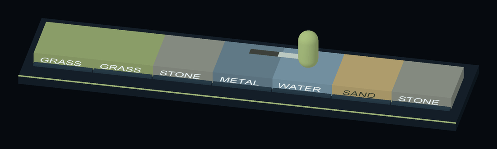

# Пример EnumValues

Персонаж ходит по ряду плиток. Цвет плитки, цвет следа, интервал обновления цвета и скорость — всё это `EnumValues`-поиски по enum поверхности или `[Flags]`-enum рельефа, настроенные в инспекторе со значением по умолчанию. Справочник — [EnumValues](../../../Documentation/ru/06-enum-values.md).

```csharp
[SerializeField] private EnumValues<SurfaceType, float> _stepInterval; // enum задан в коде
[SerializeField] private EnumValues<float> _speedByTerrain;            // enum выбран в инспекторе
```


Цвета поверхностей и следов; у каждой таблицы есть Default Value.

## Как открыть

1. Импортируйте пример и откройте `Scenes/EnumValues.unity`.
2. Войдите в Play Mode: **Walker** проходит семь плиток, оставляя непрерывную цветную линию. Её старый конец сокращается через две секунды. На горячем металле персонаж движется быстрее, на мокрой траве — медленнее. Мягкий песок даёт множитель скорости `0.4`: ниже, чем у сухого камня (`1`) и мокрого скользкого камня (`0.5`).



Персонаж проходит по разным поверхностям и оставляет непрерывную цветную линию.

## Попробуйте

1. **Типизированный вариант.** Выберите `Data/SurfacePalette.asset`. Обе таблицы — `EnumValues<SurfaceType, Color>`: строка с типом enum только для чтения, потому что тип задан полем. Поменяйте цвет `Grass` — плитки перекрасятся сразу, без Play Mode.
2. **Значение по умолчанию.** В `Footprint Colors` есть строки только для `Grass`, `Sand` и `Water`. Следы на камне и металле берут `Default Value`. Правый клик по полю → **Populate Missing Enum Members** добавит остальные строки с этим значением.
3. **Нетипизированный вариант.** Выберите **Walker**. `Speed By Terrain` — это `EnumValues<float>`, чей enum, `TerrainFlags`, выбран в строке заголовка. Каждый ключ — выпадающий список флагов, а `Wet, Slippery` — отдельная строка.
4. **Правила поиска для `[Flags]`**, видимые, пока ходок пересекает плитки:
   - сначала выигрывает **точный** ключ: плитка `Water (Wet, Slippery)` даёт строку `Wet, Slippery` (`0.5`), хотя строки `Wet` и `Slippery` тоже есть;
   - иначе выигрывает **первая строка, все флаги которой содержатся** в значении: плитка только с `Wet` даёт `0.8`;
   - ничего не совпало, включая `None` — **Default Value** (`1`).
5. **Перебор.** Правый клик **Walker → Log Tables**. `foreach` выдаёт настроенные строки в порядке списка; значение по умолчанию в перебор не входит.
6. **Измените enum.** Добавьте член в `SurfaceType` в коде: ничего не ломается, новая поверхность просто берёт значение по умолчанию, пока вы не добавите строку. Ключи хранятся по имени, так что и переставлять члены безопасно.

## Куда смотреть

| Файл | Что показывает |
|---|---|
| `Scripts/SurfacePalette.cs` | `EnumValues<TEnum, TValue>` на ScriptableObject |
| `Scripts/Walker.cs` | Оба варианта в компоненте, `GetValue` по обычному и `[Flags]`-ключу, `foreach` |
| `Scripts/SurfaceTrail.cs` | Рисует непрерывную линию и убирает старые точки |
| `Scripts/SurfaceTile.cs` | Следит за цветом из палитры через editor update; применяет изменения и Undo без Play Mode |
| `Scripts/TerrainFlags.cs` | `[Flags]`-enum с комбинируемыми членами |
