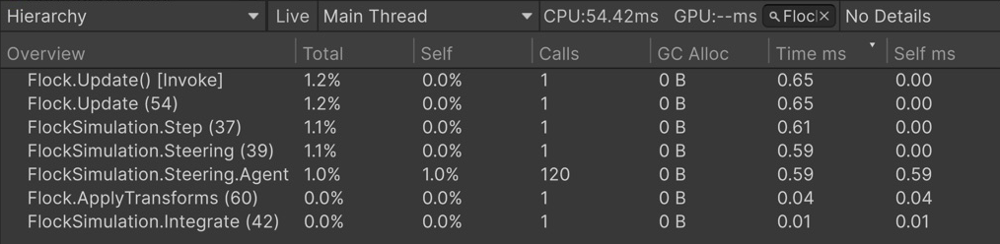

# ProfilerMarkers Sample

A flock of cubes steered by a plain C# simulation, with `this.Marker()` around each phase. The source generator turns every call site into a static `ProfilerMarker`, so the Profiler shows a named tree of the frame with no marker fields written by hand. The API reference lives in [ProfilerMarkers](../../../Documentation/05-profiler-markers.md).

```csharp
using var _ = this.Marker();                   // "FlockSimulation.Step (line)", the rest of the method
using (this.Marker().WithName("Steering"))     // "FlockSimulation.Steering (line)", the block
    ComputeSteering(neighborRadius);
```



Filter by Flock to see generated marker names. Steering.Agent has 120 calls for 120 agents; timings vary by machine.

## Open it

1. Import the sample and open `Scenes/ProfilerMarkers.unity`.
2. Open **Window → Analysis → Profiler**, enter Play Mode and select a frame in the CPU module.
3. In **Hierarchy** view, expand `PlayerLoop → Update.ScriptRunBehaviourUpdate → Flock.Update (…)`.


The flock simulation whose phases are measured by the markers above.

## Try

1. **The tree mirrors the `using` scopes.** Under `Flock.Update` you find `FlockSimulation.Step`, under it `FlockSimulation.Steering` and `FlockSimulation.Integrate`, then `Flock.ApplyTransforms` as a sibling. Nesting needs no wiring; it follows the code.
2. **One marker, many samples.** `Steering.Agent` sits inside a loop. The Profiler shows one row with `Calls` equal to the agent count, not one row per agent: the name is fixed per call site.
3. **Turn the knobs.** In Play Mode, raise `Count` on **Flock** to 400: the flock is recreated immediately. Compare `Steering` on subsequent frames, skipping the recreation frame. Lower `Neighbor Radius`: fewer neighbors need extra calculations, but every pair is still checked — the algorithm is O(N²). Lower `Count` to substantially reduce the number of checks. Actual timings depend on your machine; Deep Profile is not needed.
4. **Any class, any scope.** `FlockSimulation` is not a `MonoBehaviour`. The local function in `Flock.InitializeAgents` gets its marker named after `InitializeAgents`, the enclosing method. Find it in the startup frame or a frame where you change `Count`.
5. **The line suffix.** Every name ends with `(line)`, so two markers in one method never collide, and a marker moved in the file changes its suffix. Search the Profiler for `FlockSimulation.` to list all of them.
6. **Free in a release build.** The generated dispatcher is wrapped in `#if ENABLE_PROFILER`; without the profiler every call returns `default`.

## Where to look

| File | Shows |
|---|---|
| `Scripts/FlockSimulation.cs` | Method-wide, block and per-iteration markers in a plain class |
| `Scripts/Flock.cs` | The frame entry point, a marker inside a local function |
