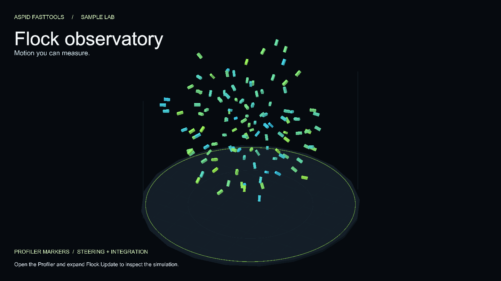

# Пример ProfilerMarkers



Стая кубов, которой управляет обычный C#-класс, и `this.Marker()` вокруг каждой фазы. Генератор превращает каждый вызов в статический `ProfilerMarker`, поэтому Profiler показывает именованное дерево кадра без единого поля маркера, написанного руками. Справочник — [ProfilerMarkers](../../../Documentation/ru/05-profiler-markers.md).

```csharp
using var _ = this.Marker();                   // "FlockSimulation.Step (line)", до конца метода
using (this.Marker().WithName("Steering"))     // "FlockSimulation.Steering (line)", блок
    ComputeSteering(neighborRadius);
```


Поиск Flock показывает сгенерированные имена маркеров. У Steering.Agent — 120 вызовов на 120 агентов; время зависит от машины.

## Как открыть

1. Импортируйте пример и откройте `Scenes/ProfilerMarkers.unity`.
2. Откройте **Window → Analysis → Profiler**, войдите в Play Mode и выберите кадр в модуле CPU.
3. В режиме **Hierarchy** разверните `PlayerLoop → Update.ScriptRunBehaviourUpdate → Flock.Update (…)`.


Симуляция стаи, фазы которой измеряют показанные выше маркеры.

## Попробуйте

1. **Дерево повторяет области `using`.** Под `Flock.Update` лежит `FlockSimulation.Step`, под ним `FlockSimulation.Steering` и `FlockSimulation.Integrate`, а рядом — `Flock.ApplyTransforms`. Вложенность не нужно настраивать, она следует за кодом.
2. **Один маркер, много сэмплов.** `Steering.Agent` стоит внутри цикла. Profiler показывает одну строку с `Calls`, равным числу агентов, а не строку на агента: имя фиксировано на точку вызова.
3. **Покрутите ручки.** В Play Mode поднимите `Count` у **Flock** до 400: стая пересоздаётся сразу. Сравните время `Steering` на следующих кадрах, пропустив кадр пересоздания. Уменьшите `Neighbor Radius`: для найденных соседей станет меньше вычислений, но проверка всех пар останется — алгоритм имеет сложность O(N²). Чтобы заметно сократить число проверок, уменьшите `Count`. Конкретное время зависит от машины; Deep Profile не нужен.
4. **Любой класс, любая область.** `FlockSimulation` — не `MonoBehaviour`. Локальная функция в `Flock.InitializeAgents` получает маркер с именем `InitializeAgents`, объемлющего метода. Найдите его в кадре запуска или изменения `Count`.
5. **Суффикс со строкой.** Каждое имя заканчивается `(line)`, поэтому два маркера в одном методе не пересекаются, а маркер, перемещённый по файлу, меняет суффикс. Поищите в Profiler `FlockSimulation.`, чтобы увидеть их все.
6. **Бесплатно в релизной сборке.** Сгенерированный диспетчер обёрнут в `#if ENABLE_PROFILER`; без профайлера каждый вызов возвращает `default`.

## Куда смотреть

| Файл | Что показывает |
|---|---|
| `Scripts/FlockSimulation.cs` | Маркеры на весь метод, на блок и на итерацию в обычном классе |
| `Scripts/Flock.cs` | Точка входа кадра, маркер внутри локальной функции |
