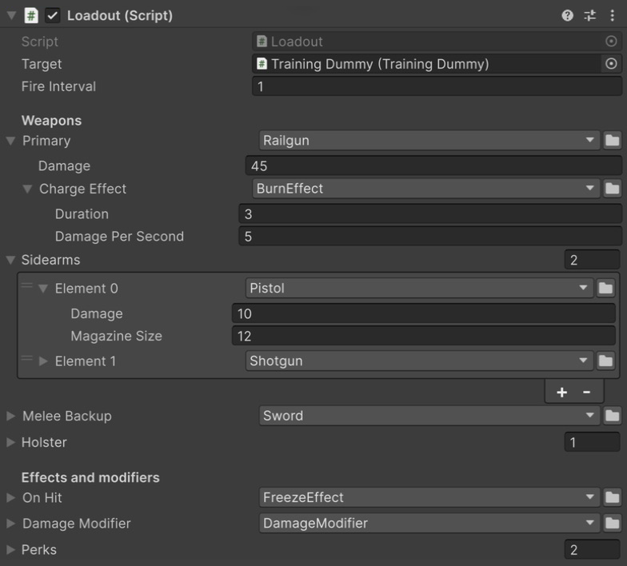
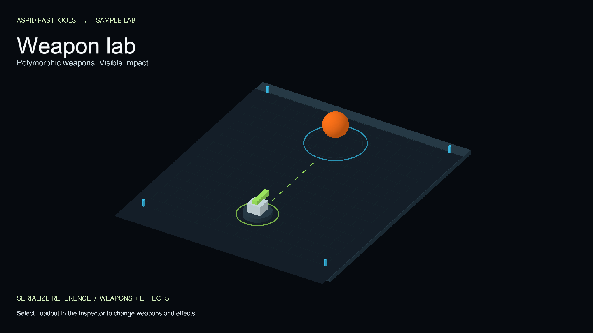

# SerializeReferences Sample

A turret that fires polymorphic weapons at a training dummy. Every weapon, effect and modifier is a `[SerializeReference]` field with a `[TypeSelector]` dropdown, and the sample ships assets that are broken on purpose so you can walk through the repair tools. The feature reference lives in [SerializeReference Selector](../../../Documentation/03-serialize-reference-selector.md) and [SerializeReference Tooling](../../../Documentation/04-serialize-reference-tooling.md).

```csharp
[TypeSelector]
[SerializeReference] private IWeapon _primary;
```



Weapons, a nested burn effect, and modifiers in the Loadout Inspector.

## Open it

1. Import the sample and open `Scenes/SerializeReferences.unity`.
2. Select **Loadout**. Enter Play Mode: the primary weapon and the sidearms take turns hitting the dummy once a second; it shrinks, tints while burning or frozen, and resets when destroyed. The Console shows each hit.



The dummy changes color and shrinks as the configured weapons and effects deal damage.

## Your first five minutes

1. Before Play Mode, select **Loadout** and expand `Primary`: it is a `Railgun` with a nested `Charge Effect`. Enter Play Mode and watch the dummy take hits and the Console report them.
2. In `Sidearms`, choose `Pistol`, set `Damage` to `37`, switch it to `Shotgun` and back. Check that `Damage` is still `37`.
3. Press **+** on `Sidearms` and add another weapon through the picker. It joins the firing rotation.
4. Set `Primary` to `<None>` to see the `Required` notice, then pick a weapon again.
5. Exit Play Mode: component edits made during play reset. Open `Scripts/Loadout.cs` and match the Inspector fields to `[SerializeReference]` and `[TypeSelector]`.

That completes the basic scenario. The sections below are independent exercises in authoring, generics, repair and IMGUI.

## What affects gameplay

- `Primary` and `Sidearms` fire in turn. `On Hit` applies after a hit; `Railgun.Charge Effect` applies after a railgun hit.
- `DamageModifier` changes damage, including when placed in `Perks`.
- `Melee Backup` and `Holster` demonstrate filtering and nested containers; they do not join the firing rotation.
- `Modifier<T>`, `AmmoModifier` and `NameModifier` demonstrate generic type selection and data storage. They do not change damage, ammunition or weapon names. Inspect their values through **Loadout → Log Loadout** in the component context menu.

## Advanced exercises: authoring

1. **Pick an implementation.** Open the `Primary` dropdown: a searchable window lists every concrete `IWeapon`, grouped under **Weapons/Melee** and **Weapons/Ranged** by `[TypeSelectorDisplay]`. `DebugWeapon` is not there: it is `Hidden`, meant for code only. Pick `Shotgun`; its own fields appear inline.
2. **Switching keeps shared data.** Set a `Pistol` in `Sidearms`, change its `Damage`, switch it to `Shotgun` and back: the value survives because both types declare `_damage`.
3. **Lists.** Press **+** on `Sidearms`: the picker opens instead of duplicating the last element, so no two elements share one instance.
4. **Narrowing.** `Melee Backup` is declared `IWeapon` but carries `[TypeSelector(typeof(IMelee))]`, so only `Sword` is offered. `Holster` does the same inside a plain `[Serializable]` container, one level down.
5. **Nesting.** Choose `Railgun` in `Primary` and `BurnEffect` in its `Charge Effect`: the effect is a `[SerializeReference]` of its own with its own dropdown. The dummy catches fire when the railgun hits.
6. **Abstract base.** `On Hit` is a `StatusEffect`; the picker offers `BurnEffect` and `FreezeEffect`, never the abstract base.
7. **Generics.** `Damage Modifier` is a `Modifier<float>`: `T` is fixed, so `DamageModifier` and `Modifier<float>` are offered and created directly. `Perks` is a `List<IModifier>`: it offers the closed subclasses **and** the open `Modifier<T>`, which asks for `T` on a second page.
8. **Required.** Set `Primary` to `<None>`: a notice appears, and the field counts as a violation for the build/CI gate.
9. **Right-click any dropdown** for Copy / Paste, Make Unique Reference, Save as Template, Find Usages and Create New Script.

## Advanced exercises: repair

The `Presets/` and `Prefabs/` folders hold assets whose stored type identities are stale or gone:

| Asset | What is wrong | What to do |
|---|---|---|
| `Presets/BrokenWeaponPreset.asset` | `Weapon` stores a `GhostWeapon` that does not exist | Select it. The field shows `<Missing GhostWeapon>` and a **Fix** button; pick `Pistol`. Damage and magazine size are preserved. |
| `Presets/BrokenArsenalPreset.asset` | The same `GhostWeapon`, three times | Open **Tools → Aspid 🐍 → FastTools → Project References**, **Scan Project**: both presets collapse into one `GhostWeapon` group. **Fix all** re-points every entry at once. |
| `Presets/MovedWeaponPreset.asset` | `Pistol` stored under an old namespace | The notice ends with a one-click **Smart Fix** suggestion (`→ Pistol?`). Smart Fix ranks a `[MovedFrom]` match, a same-named type, a casing change and a near-miss, and never applies itself. |
| `Presets/RenamedWeaponPreset.asset` | Stores `CrossbowLauncher`; the class is now `Crossbow` with `[MovedFrom]` | The Inspector already shows a healthy `Crossbow`, only the file is stale. In **Project References** the group reads as a pending migration with **Migrate all**, which bakes the rename into the file. |
| `Prefabs/BrokenLoadout.prefab` | `Sidearms[2]` is a missing `GhostCrossbow`; `Sidearms[0]` and `[1]` share one `Pistol` | Select it in the Project window. The missing element offers **Fix**; the shared pair carries a colored notice, and **Make Unique Reference** splits it. **Asset References** maps the whole graph of the prefab in one view. |

For group repair, start with **Scan Project** before fixing individual presets. If `BrokenWeaponPreset` is already repaired, the `GhostWeapon` group contains only the remaining broken entries. To repeat the exercises, reimport the sample and overwrite its files; this also resets your changes to the imported sample.

Repair rewrites the asset file, so it needs a saved asset: ScriptableObjects and prefabs selected in the Project, Prefab Mode, or a clean saved scene.

## The IMGUI path

`WeaponPreset` has an IMGUI inspector (`Scripts/Editor/WeaponPresetEditor.cs`). Overriding `OnInspectorGUI` alone routes every nested drawer through IMGUI at feature parity. The one difference is a list: Unity applies the drawer per element, so its **+** would clone the last element; `SerializeReferenceIMGUIList.Draw` restores the picker-backed add. For a custom editor that draws managed references without `[TypeSelector]` on the field, `SerializeReferenceEditorGUI.CreateField` / `CreateList` / `DrawFieldLayout` build the same controls.

## Where to look

| File | Shows |
|---|---|
| `Scripts/Loadout.cs` | Every field shape: single, list, narrowed, container, abstract base, closed and open generics, `Required` |
| `Scripts/Weapons/` | The `IWeapon` hierarchy, `[TypeSelectorDisplay]` groups, a `Hidden` type, `[MovedFrom]` on `Crossbow`, a nested reference in `Railgun` |
| `Scripts/Effects/`, `Scripts/Modifiers/` | An abstract base and a concrete open generic |
| `Scripts/TrainingDummy.cs` | The target the weapons and effects act on |
| `Scripts/WeaponPreset.cs` + `Presets/` | The repair scenarios |
| `Scripts/Editor/WeaponPresetEditor.cs` | An IMGUI inspector with `SerializeReferenceIMGUIList` |
