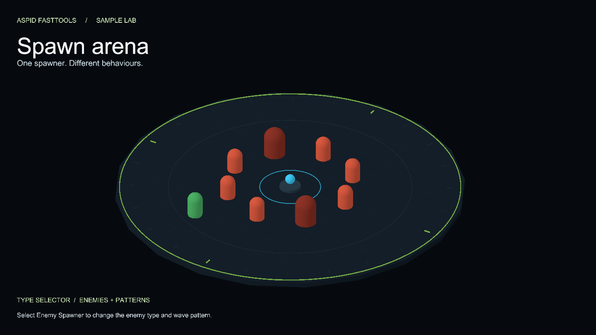
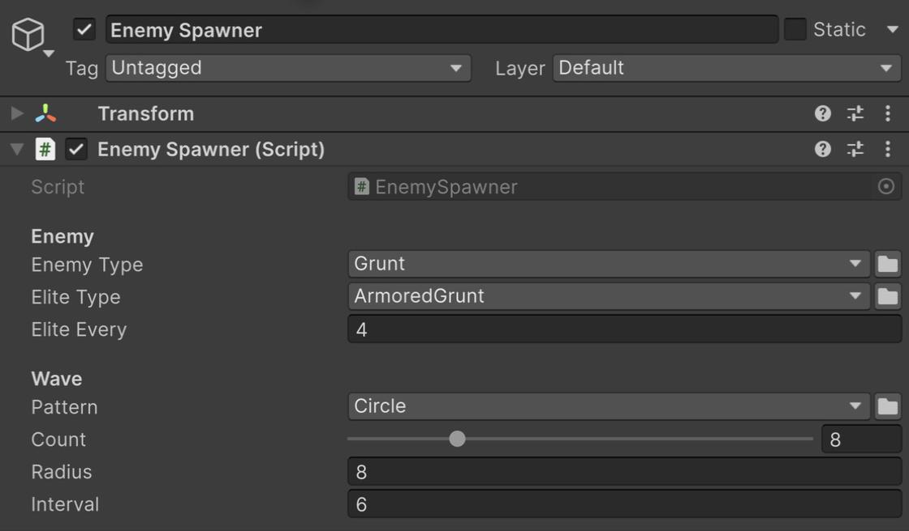
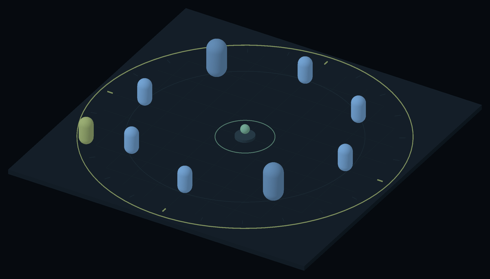

# Types Sample

Storing a type lets you choose which objects to create and which behavior to use in the Inspector, without changing the code that works with them. These examples show where this is useful and how to use it: configure regular and elite enemy types, choose a wave layout, and replace the type of an existing component while preserving shared data.

For the API reference, see [Serializable Type System](../../../Documentation/02-serializable-types.md).

Enemy types and spawn pattern in the Inspector.

## Open it

1. Open the Welcome Window through **Tools → Aspid 🐍 → FastTools → Welcome**.
2. In **Samples**, find **Types** and press **Import**. If the card already says **Remove**, the sample is imported — continue to the next step.
3. In the Project window, open `Assets/Samples/Aspid.FastTools/<version>/Types`, then open `Scenes/Types.unity` and select **Enemy Spawner**.
4. Enter Play Mode: a wave of eight capsules spawns in a circle every six seconds, every fourth one an `ArmoredGrunt`, and walks to the center.

A wave of regular and elite enemies moves toward the center.

## Try

1. **Rename-safe component type.** `Enemy Type` is a `SerializableMonoScript<Enemy>`: the field references the script asset, not the class name. Rename the class in `Scripts/Enemies/Grunt.cs` to `Footman` (and the file), let Unity recompile, and the field still reads `Footman`. A `SerializableType` would have gone `<Missing>`.
2. **Dependent picker.** `Elite Type` is a plain `string` with `[TypeSelector(nameof(_enemyType))]`, so its picker offers only subtypes of whatever `Enemy Type` currently holds. Switch `Enemy Type` to `Archer` and open `Elite Type`: `Sniper` is offered, `ArmoredGrunt` is gone.
3. **Picker presentation.** Open `Pattern`. The candidates sit under one **Spawn Patterns** group with friendly names, tooltips and icons, all from `[TypeSelectorDisplay]` on the pattern classes. `OriginPattern` is not listed because it is `Hidden`; `Allow = TypeAllow.None` on the field keeps the `ISpawnPattern` interface itself out too. Pick **Grid** and spawn a wave.
4. **Required.** Set `Enemy Type` to `<None>`: an inline notice appears, and the field counts as a violation for the build/CI gate described in [SerializeReference Tooling](../../../Documentation/04-serialize-reference-tooling.md).
5. **Swap a component in place.** Select **Placed Enemy (swap its type)**. The dropdown at the top of its Inspector comes from the `ComponentTypeSelector` field on `Enemy`. Switch `Archer` to `Brute`: `Health` and `Speed`, declared on the shared base, keep their values, while `Keep Distance` (Archer-only) is gone.

## Where to look

| File | Shows |
|---|---|
| `Scripts/EnemySpawner.cs` | `SerializableMonoScript<T>` with `Required`, a member-referenced `[TypeSelector]`, `SerializableType<T>` with `Allow = TypeAllow.None`, resolving each with `.Type` / `Type.GetType` |
| `Scripts/Enemies/Enemy.cs` | The `ComponentTypeSelector` field on the base class; subclasses in the same folder |
| `Scripts/Spawning/*.cs` | Plain C# strategies decorated with `[TypeSelectorDisplay]` (`Name`, `Group`, `Tooltip`, `Icon`, `Hidden`) |

Related: [SerializeReferences sample](../../SerializeReferences/Documentation/README.md) for `[TypeSelector]` on `[SerializeReference]` fields, [EditorTools sample](../../EditorTools/Documentation/README.md) for opening the same picker from your own editor code.
