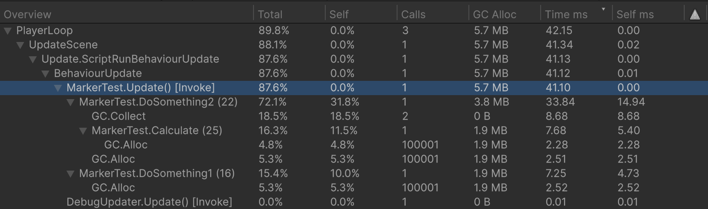

# Unity Fast Tools
**Unity Fast Tools** is a set of tools designed to minimize routine code writing in Unity.
## Source Code
### [[Aspid.UnityFastTools](https://github.com/VPDPersonal/Aspid.UnityFastTools)] [[Aspid.UnityFastTools.Generators](https://github.com/VPDPersonal/Aspid.UnityFastTools.Generators)]

---

## Integration
You can install Aspid.UnitiFastTools using one of the following methods:
* **Download .unitypackage**: Visit the [Release page on GitHub](https://github.com/VPDPersonal/Aspid.UnityFastTools/releases) and download the latest version, `Aspid.UnityFastTools.X.X.X.unitypackage`. Import it into your project.

---

## ProfilerMarker
``` csharp
using UnityEngine;
using Aspid.UnityFastTools;

public class MyBehaviour : MonoBehaviour
{
    private void Update()
    {
        DoSomething1();
        DoSomething2();
    }

    private void DoSomething1()
    {
        using var _ = this.Marker();
        // Some code
    }

    private void DoSomething2()
    {
        using (this.Marker())
        {
            // Some code
            using var _ = this.Marker().WithName("Calculate");
            // Some code
        }    
    }
}
```
### Generated code
``` csharp
using System;
using Unity.Profiling;
using System.Runtime.CompilerServices;

internal static class __MyBehaviourProfilerMarkerExtensions
{
    private static readonly ProfilerMarker DoSomething1_line_13 = new("MyBehaviour.DoSomething1 (13)");
    private static readonly ProfilerMarker DoSomething2_line_19 = new("MyBehaviour.DoSomething2 (19)");
    private static readonly ProfilerMarker DoSomething2_line_22 = new("MyBehaviour.Calculate (22)");
 
    public static ProfilerMarker.AutoScope Marker(this MyBehaviour _, [CallerLineNumberAttribute] int line = -1)
    {
        if (line is 13) return DoSomething1_line_13.Auto();
        if (line is 19) return DoSomething2_line_19.Auto();
        if (line is 22) return DoSomething2_line_22.Auto();
        
        throw new Exception();
    }
}
```

### Result



## SerializedProperty Extensions
``` csharp
SerializedProperty property = GetProperty();

property.ApplyModifiedProperties();
// property.serializedObject.ApplyModifiedProperties();

property.SetValue(10).ApplyModifiedProperties();
// Or
property.SetValueAndApply(10);
// Or
property.SetInt(10).ApplyModifiedProperties();
// Or
property.SetIntAndApply(10);
// property.intValue = 10;
// property.serializedObject.ApplyModifiedProperties();

property.SetValue(intValue).SetInt(intValue).SetValueAndApply(intValue).SetIntAndApply(intValue);
property.SetValue(uintValue).SetUint(uintValue).SetValueAndApply(uintValue).SetUintAndApply(uintValue);
property.SetValue(longValue).SetLong(longValue).SetValueAndApply(longValue).SetLongAndApply(longValue);
property.SetValue(ulongValue).SetUlong(ulongValue).SetValueAndApply(ulongValue).SetUlongAndApply(ulongValue);
property.SetValue(floatValue).SetFloat(floatValue).SetValueAndApply(floatValue).SetFloatAndApply(floatValue);
property.SetValue(doubleValue).SetDouble(doubleValue).SetValueAndApply(doubleValue).SetDoubleAndApply(doubleValue);
property.SetValue(boolValue).SetBool(boolValue).SetValueAndApply(boolValue).SetBoolAndApply(boolValue);
property.SetValue(rectValue).SetRect(rectValue).SetValueAndApply(rectValue).SetRectAndApply(rectValue);
property.SetValue(rectIntValue).SetRectInt(rectIntValue).SetValueAndApply(rectIntValue).SetRectIntAndApply(rectIntValue);
property.SetValue(boundsValue).SetBounds(boundsValue).SetValueAndApply(boundsValue).SetBoundsAndApply(boundsValue);
property.SetValue(boundsIntValue).SetBoundsInt(boundsIntValue).SetValueAndApply(boundsIntValue).SetBoundsIntAndApply(boundsIntValue);
property.SetValue(colorValue).SetColor(colorValue).SetValueAndApply(colorValue).SetColorAndApply(colorValue);
property.SetValue(gradientValue).SetGradient(gradientValue).SetValueAndApply(gradientValue).SetGradientAndApply(gradientValue);
property.SetValue(hash128Value).SetHash128(hash128Value).SetValueAndApply(hash128Value).SetHash128AndApply(hash128Value);
property.SetValue(vactor4Value).SetVector4(vactor4Value).SetValueAndApply(vactor4Value).SetVector4AndApply(vactor4Value);
property.SetValue(vactor3Value).SetVector3(vactor3Value).SetValueAndApply(vactor3Value).SetVector3AndApply(vactor3Value);
property.SetValue(vactor3IntValue).SetVector3Int(vactor3IntValue).SetValueAndApply(vactor3IntValue).SetVector3IntAndApply(vactor3IntValue);
property.SetValue(vactor2Value).SetVector2(vactor2Value).SetValueAndApply(vactor2Value).SetVector2AndApply(vactor2Value);
property.SetValue(vactor2IntValue).SetVector2Int(vactor2IntValue).SetValueAndApply(vactor2IntValue).SetVector2IntAndApply(vactor2IntValue);
property.SetValue(quaternionValue).SetQuaternion(quaternionValue).SetValueAndApply(quaternionValue).SetQuaternionAndApply(quaternionValue);
property.SetValue(stringValue).SetString(stringValue).SetValueAndApply(stringValue).SetStringAndApply(stringValue);
property.SetValue(animationCurveValue).SetAnimationCurveValue(animationCurveValue).SetValueAndApply(animationCurveValue).SetAnimationCurveValueAndApply(animationCurveValue);

property.SetEnumFlag(intValue).SetEnumFlagAndApply(intValue);
property.SetEnumIndex(intValue).SetEnumIndexAndApply(intValue);
property.SetArraySize(intValue).SetArraySizeAndApply(intValue);
property.SetManagedReference(objectValue).SetManagedReferenceAndApply(objectValue);
property.SetObjectReference(unityObjectValue).SetObjectReferenceAndApply(unityObjectValue);
property.SetExposedReference(unityObjectValue).SetExposedReferenceAndApply(unityObjectValue);

// For Unity 6
property.SetBoxed(objectValue).SetBoxedAndApply(objectValue);

// For Unity 6.2
property.SetValue(entityIdValue).SetEntityId(entityIdValue).SetValueAndApply(entityIdValue).SetEntityIdAndApply(entityIdValue);
```

## IMGUI Extensions
``` csharp
usign UnityEditor;
using Aspid.UnityFastTools.Editors;

[CustomEditor(typeof(MyBegaviour))]
public class MyEditor : Editor
{
    public void override OnInspectorGUI()
    {   
        // Or  using (VerticalScope.Begin());
        using (AspidEdtiroGUILayout.BeginVertical())
        {
            
        }
        
        // Or  using (HorizontalScope.Begin());
        using (AspidEdtiroGUILayout.BegingHorizontal())
        {   
        
        }
        
        var position = Vector2.zero;
        // Or  using (ScrollViewScope.Begin(ref position));
        using (AspidEdtiroGUILayout.BeginScrollView(ref position))
        {   
        
        }
    }
}
```

## VisualElement Extensions
``` csharp
using UnityEditor;
using UnityEngine;
using Aspid.UnityFastTools;
using UnityEngine.UIElements;
using Aspid.UnityFastTools.Editors;

[CustomEditor(typeof(VisualElementInspector))]
public class VisualElementInspectorEditor : Editor
{
    public override VisualElement CreateInspectorGUI()
    {
        const string iconPath = "Editor/Aspid.UnityFastTools Icon";
        
        var scriptName = target.GetScriptName();
        var darkColor = new Color(0.15f, 0.15f, 0.15f);
        var lightColor = new Color(0.75f, 0.75f, 0.75f);
        
        return new VisualElement()
            .SetName("Header")
            .SetBackgroundColor(darkColor)
            .SetFlexDirection(FlexDirection.Row)
            .SetPadding(top : 5, bottom : 5, left: 10, right: 10)
            .SetBorderRadius(topLeft: 10, topRight:10, bottomLeft:10, bottomRight:10)
            .AddChild(new Image()
                .SetName("HeaderIcon")
                .AddOpenScriptCommand(target)
                .SetImageFromResource(iconPath)
                .SetSize(width: 40, height: 40))
            .AddChild(new Label(scriptName)
                .SetName("HeaderText")
                .SetFlexGrow(1)
                .SetFontSize(16)
                .SetFlexShrink(1)
                .SetMargin(left: 10)
                .SetColor(lightColor)
                .SetAlignSelf(Align.Center)
                .SetOverflow(Overflow.Hidden)
                .SetWhiteSpace(WhiteSpace.NoWrap)
                .SetTextOverflow(TextOverflow.Ellipsis)
                .SetUnityFontStyleAndWeight(FontStyle.Bold)
            );
    }
}
```

### Result


