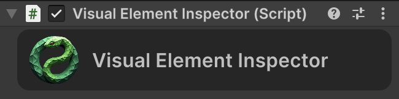

# Unity Fast Tools
**Unity Fast Tools** is a set of tools designed to minimize routine code writing in Unity.
## Source Code
### [[Aspid.UnityFastTools](https://github.com/VPDPersonal/Aspid.UnityFastTools)] [[Aspid.UnityFastTools.Generators](https://github.com/VPDPersonal/Aspid.UnityFastTools.Generators)]

---

## Integration
You can install Aspid.UnitiFastTools using one of the following methods:
* **Download .unitypackage**: Visit the [Release page on GitHub](https://github.com/VPDPersonal/Aspid.UnityFastTools/releases) and download the latest version, `Aspid.UnityFastTools.X.X.X.unitypackage`. Import it into your project.

---

## ProfilerMarker
``` csharp
using UnityEngine;
using Aspid.UnityFastTools;

public class MyBehaviour : MonoBehaviour
{
    private void Update()
    {
        DoSomething1();
        DoSomething2();
    }

    private void DoSomething1()
    {
        using var _ = this.Marker();
        // Some code
    }

    private void DoSomething2()
    {
        using (this.Marker())
        {
            // Some code
            using var _ = this.Marker().WithName("Calculate");
            // Some code
        }    
    }
}
```
### Generated code
``` csharp
using System;
using Unity.Profiling;
using System.Runtime.CompilerServices;

internal static class __MyBehaviourProfilerMarkerExtensions
{
    private static readonly ProfilerMarker DoSomething1_line_13 = new("MyBehaviour.DoSomething1 (13)");
    private static readonly ProfilerMarker DoSomething2_line_19 = new("MyBehaviour.DoSomething2 (19)");
    private static readonly ProfilerMarker DoSomething2_line_22 = new("MyBehaviour.Calculate (22)");
 
    public static ProfilerMarker.AutoScope Marker(this MyBehaviour _, [CallerLineNumberAttribute] int line = -1)
    {
        if (line is 13) return DoSomething1_line_13.Auto();
        if (line is 19) return DoSomething2_line_19.Auto();
        if (line is 22) return DoSomething2_line_22.Auto();
        
        throw new Exception();
    }
}
```

### Result


## IMGUI Extensions
``` csharp
usign UnityEditor;
using Aspid.UnityFastTools.Editors;

[CustomEditor(typeof(MyBegaviour))]
public class MyEditor : Editor
{
    public void override OnInspectorGUI()
    {   
        // Or  using (VerticalScope.Begin());
        using (AspidEdtiroGUILayout.BeginVertical())
        {
            
        }
        
        // Or  using (HorizontalScope.Begin());
        using (AspidEdtiroGUILayout.BegingHorizontal())
        {   
        
        }
        
        var position = Vector2.zero;
        // Or  using (ScrollViewScope.Begin(ref position));
        using (AspidEdtiroGUILayout.BeginScrollView(ref position))
        {   
        
        }
    }
}
```

## VisualElement Extensions
``` csharp
using UnityEditor;
using UnityEngine;
using Aspid.UnityFastTools;
using UnityEngine.UIElements;
using Aspid.UnityFastTools.Editors;

[CustomEditor(typeof(VisualElementInspector))]
public class VisualElementInspectorEditor : Editor
{
    public override VisualElement CreateInspectorGUI()
    {
        const string iconPath = "Editor/Aspid.UnityFastTools Icon";
        
        var scriptName = target.GetScriptName();
        var darkColor = new Color(0.15f, 0.15f, 0.15f);
        var lightColor = new Color(0.75f, 0.75f, 0.75f);
        
        return new VisualElement()
            .SetName("Header")
            .SetBackgroundColor(darkColor)
            .SetFlexDirection(FlexDirection.Row)
            .SetPadding(top : 5, bottom : 5, left: 10, right: 10)
            .SetBorderRadius(topLeft: 10, topRight:10, bottomLeft:10, bottomRight:10)
            .AddChild(new Image()
                .SetName("HeaderIcon")
                .AddOpenScriptCommand(target)
                .SetImageFromResource(iconPath)
                .SetSize(width: 40, height: 40))
            .AddChild(new Label(scriptName)
                .SetName("HeaderText")
                .SetFlexGrow(1)
                .SetFontSize(16)
                .SetFlexShrink(1)
                .SetMargin(left: 10)
                .SetColor(lightColor)
                .SetAlignSelf(Align.Center)
                .SetOverflow(Overflow.Hidden)
                .SetWhiteSpace(WhiteSpace.NoWrap)
                .SetTextOverflow(TextOverflow.Ellipsis)
                .SetUnityFontStyleAndWeight(FontStyle.Bold)
            );
    }
}
```

### Result



